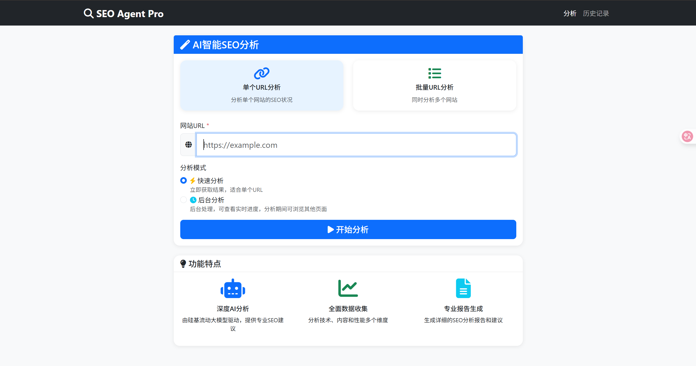
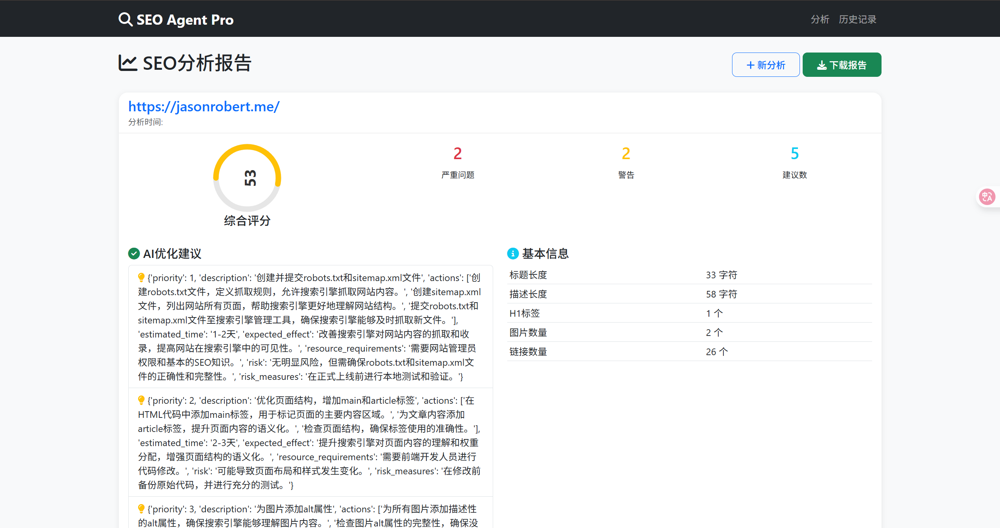
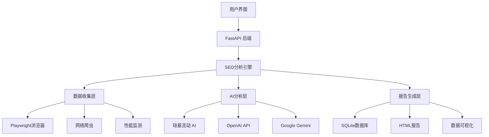
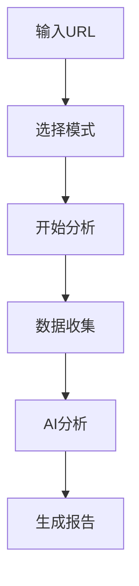
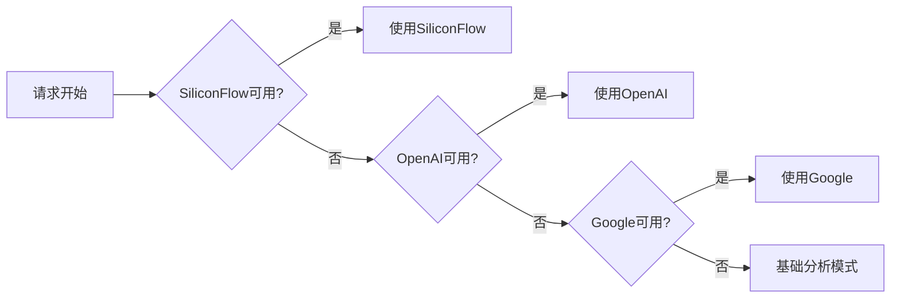

# SEO Agent Pro - 智能SEO分析系统 🚀

<div align="center">

[](https://www.python.org/)
[](https://fastapi.tiangolo.com/)
[](LICENSE)
[](https://seo-agent-pro-jsyb.onrender.com)

**🎯 专业级AI驱动的SEO分析工具 | 三专家协作 | 智能评分 | 一键部署**

[🚀 立即体验](https://seo-agent-pro-jsyb.onrender.com) · [📖 文档](#-使用指南) · [💬 反馈](https://github.com/JasonRobertDestiny/SEO_Agent/issues) · [⭐ 给个Star](https://github.com/JasonRobertDestiny/SEO_Agent)

</div>

---

## 🌟 项目亮点

> **SEO Agent Pro** 是一个革命性的AI驱动SEO分析系统，通过三个专业AI代理的协作，为您的网站提供专业级的SEO诊断和优化建议。

### 🎯 核心优势

| 特性 | 描述 | 优势 |
|------|------|------|
| 🤖 **AI三专家系统** | 数据分析师 + 策略顾问 + 报告设计师 | 多角度深度分析，更专业准确 |
| 🔍 **智能分析引擎** | 支持多AI模型（硅基流动/OpenAI/Google） | 高质量分析结果，智能备份机制 |
| 📊 **全方位数据收集** | 技术SEO + 内容分析 + 性能监测 | 360度无死角网站诊断 |
| 🎨 **现代化界面** | Bootstrap 5 + 响应式设计 | 优秀的用户体验，移动端友好 |
| ⚡ **高性能架构** | FastAPI + 异步处理 + 智能缓存 | 快速响应，支持高并发 |
| 🛡️ **企业级安全** | 环境变量 + 数据加密 + 安全存储 | 保护隐私，符合安全标准 |

### 💡 智能特性

- 🧠 **AI驱动分析**：基于最新大语言模型的深度SEO分析
- 📈 **智能评分系统**：0-100分专业评分，多维度权重计算
- � **实时进度跟踪**：可视化分析过程，用户体验友好
- 📋 **批量处理能力**：支持多网站同时分析，效率倍增
- 💾 **完整历史记录**：所有分析结果永久保存，便于对比分析
- 🌐 **一键云部署**：支持Render、Vercel等主流平台

## 📸 界面预览

<table>
<tr>
<td width="50%">

### 🏠 主页界面
**现代化设计 | 简洁易用**

- ✨ 直观的URL输入界面
- � 智能分析模式切换
- 📱 完美适配移动端
- 🎨 优雅的UI设计

</td>
<td width="50%">

### 📊 分析报告
**专业可视化 | 数据丰富**

- 🎯 综合评分展示
- 📋 详细问题诊断
- 💡 具体优化建议
- � 数据图表展示

</td>
</tr>
<tr>
<td align="center">



</td>
<td align="center">



</td>
</tr>
</table>

## ⚡ 快速开始

### 🎯 在线体验
**无需安装，立即使用** → [https://seo-agent-pro-jsyb.onrender.com](https://seo-agent-pro-jsyb.onrender.com)

### 💻 本地部署

<details>
<summary><b>📋 环境要求</b></summary>

- **Python**: 3.11+ 
- **系统**: Windows/Linux/macOS
- **内存**: 2GB+ 可用内存
- **网络**: 稳定的互联网连接

</details>

#### 1️⃣ 克隆项目
```bash
git clone https://github.com/JasonRobertDestiny/SEO_Agent.git
cd SEO_Agent
```

#### 2️⃣ 环境配置
```bash
# 创建虚拟环境（推荐）
python -m venv venv
source venv/bin/activate  # Linux/Mac
# 或
venv\Scripts\activate     # Windows

# 安装依赖
pip install -r requirements.txt
playwright install chromium
```

#### 3️⃣ API配置
```bash
# 复制配置模板
cp .env.example .env

# 编辑 .env 文件，添加你的API密钥
# SILICONFLOW_API_KEY=your_api_key_here
```

#### 4️⃣ 启动运行
```bash
# 一键启动
python start.py

# 或直接启动
python app.py
```

#### 5️⃣ 开始使用
🌐 打开浏览器访问: **http://localhost:8000**

## �️ 技术架构

<div align="center">



</div>

### 🏗️ 核心技术栈

<table>
<tr>
<td width="50%">

**🖥️ 后端技术**
- **FastAPI** - 高性能异步Web框架
- **Playwright** - 现代浏览器自动化
- **aiohttp** - 异步HTTP客户端
- **SQLite** - 轻量级数据库
- **python-dotenv** - 环境变量管理

</td>
<td width="50%">

**🎨 前端技术**
- **Bootstrap 5** - 响应式UI框架
- **Jinja2** - 服务端模板引擎
- **Chart.js** - 数据可视化图表
- **Font Awesome** - 矢量图标库

</td>
</tr>
</table>

### 🤖 AI模型支持

| AI提供商 | 模型 | 特点 | 优先级 |
|---------|------|------|--------|
| 🔹 **硅基流动** | Qwen2.5-VL-72B-Instruct | 中文优化，性价比高 | ⭐⭐⭐ |
| 🔸 **OpenAI** | GPT-3.5/4 系列 | 国际标准，稳定可靠 | ⭐⭐ |
| 🔹 **Google** | Gemini 系列 | 多模态能力强 | ⭐ |

## 📊 功能详解

### 🔍 智能分析引擎

<details>
<summary><b>🧠 AI三专家协作系统</b></summary>

#### 1. 📈 数据分析专家
- **职责**: 技术指标分析、性能数据评估
- **输出**: 客观数据分析、问题严重程度评估
- **专长**: SEO技术标准、网站性能优化

#### 2. 💡 策略顾问
- **职责**: 优化方案制定、策略规划
- **输出**: 改进建议、优先级排序、实施方案
- **专长**: SEO策略、竞争分析、增长规划

#### 3. 📋 报告设计师
- **职责**: 数据可视化、洞察提炼
- **输出**: 可视化报告、执行路线图
- **专长**: 数据展示、用户体验、报告设计

</details>

### 📊 数据收集维度

<table>
<tr>
<td width="33%">

**🔧 技术SEO**
- HTTPS安全性
- Canonical标签
- Robots.txt检测
- Sitemap验证
- 移动友好性
- 页面结构分析

</td>
<td width="33%">

**📝 内容分析**
- Title/Meta描述
- 标题层级结构
- 图片Alt属性
- 内链外链分析
- 关键词密度
- 内容质量评估

</td>
<td width="34%">

**⚡ 性能监测**
- 页面加载速度
- 首屏渲染时间
- 资源优化检测
- 缓存策略分析
- CDN使用检测
- 代码压缩检测

</td>
</tr>
</table>

### 🎯 评分算法

```
综合得分 = 内容质量(40%) + 技术SEO(30%) + 性能优化(30%)

问题等级:
🔴 严重 (0-40分): 影响搜索排名的关键问题
🟡 警告 (41-70分): 需要改进的重要问题  
🟢 建议 (71-100分): 优化建议和最佳实践
```

## � 使用指南

### 🎯 单个网站分析

<table>
<tr>
<td width="70%">

**操作步骤**:
1. 🌐 在首页输入目标网站URL
2. ⚡ 选择分析模式（快速/后台）
3. 🚀 点击"开始分析"按钮
4. ⏳ 等待分析完成（1-3分钟）
5. 📊 查看详细分析报告

**分析模式说明**:
- **快速模式**: 页面实时显示结果
- **后台模式**: 可切换页面，后台处理

</td>
<td width="30%" align="center">



</td>
</tr>
</table>

### 📋 批量网站分析

```bash
# 支持的URL格式
https://example1.com
https://example2.com
https://example3.com

# 分析结果
✅ 成功分析的网站将显示评分和详细报告
❌ 失败的网站会显示错误原因和建议
📊 可对比多个网站的SEO表现
```

### 📚 历史记录管理

- **查看历史**: 点击"分析历史"链接
- **重新下载**: 可重新下载历史报告
- **数据对比**: 同一网站的历史分析对比
- **批量管理**: 支持历史记录的批量操作

## ⚙️ 配置指南

### 🔐 API配置

<details>
<summary><b>🔧 环境变量配置</b></summary>

#### 1. 复制配置模板
```bash
cp .env.example .env
```

#### 2. 编辑配置文件
```env
# 硅基流动API配置（推荐 - 性价比最高）
SILICONFLOW_API_KEY=your_siliconflow_key
SILICONFLOW_BASE_URL=https://api.siliconflow.cn/v1
SILICONFLOW_MODEL=Qwen/Qwen2.5-VL-72B-Instruct

# OpenAI API配置（备用选项）
OPENAI_API_KEY=your_openai_key
OPENAI_BASE_URL=https://api.openai.com/v1
OPENAI_MODEL=gpt-3.5-turbo

# Google API配置（备用选项）
GOOGLE_API_KEY=your_google_key
GOOGLE_MODEL=gemini-2.0-flash-exp
```

#### 3. API优先级
```
系统检测顺序: SiliconFlow → OpenAI → Google → 基础模式
```

</details>

### 🗄️ 数据库配置

```bash
# 默认配置 - SQLite
数据库文件: seo_analysis.db
表结构: 自动创建
数据备份: 建议定期备份数据文件

# 高级配置 - 支持扩展到其他数据库
PostgreSQL / MySQL / MongoDB (需要修改database.py)
```

## 📁 项目结构

<details>
<summary><b>📂 完整项目目录</b></summary>

```
SEO_Agent/
├── 📄 app.py                    # FastAPI主应用
├── 🔍 seo_analyzer.py           # 核心SEO分析引擎
├── 🗄️ database.py               # 数据库操作层
├── 🚀 start.py                  # 一键启动脚本
├── 🪟 start.bat                 # Windows批处理启动
├── � requirements.txt          # Python依赖包
├── 🔧 .env.example              # 环境变量模板
├── 🚫 .gitignore                # Git忽略规则
├── ☁️ vercel.json               # Vercel部署配置
├── 📐 render.yaml               # Render部署配置
├── 🎨 templates/                # Jinja2模板目录
│   ├── 🏠 index.html            # 主页模板
│   ├── 📊 results.html          # 结果页面
│   ├── 📋 batch.html            # 批量分析页
│   └── 📚 history.html          # 历史记录页
├── 🎯 static/                   # 静态资源目录
│   ├── 🎨 css/
│   │   └── modern.css           # 现代化样式
│   ├── 🖼️ images/               # 图片资源
│   └── 📜 js/                   # JavaScript文件
├── 📊 reports/                  # 生成报告目录
├── 🗃️ seo_analysis.db           # SQLite数据库
└── 📄 seo_agent.log             # 系统日志文件
```

</details>

## � 部署指南

### ☁️ 云平台部署

<table>
<tr>
<td width="33%" align="center">

#### 🟢 Render部署
[](https://render.com)

**特点**:
- ✅ 免费额度
- ✅ 自动睡眠唤醒
- ✅ 自动HTTPS
- ✅ 持续部署

</td>
<td width="33%" align="center">

#### ⚡ Vercel部署
[](https://vercel.com)

**特点**:
- ✅ 全球CDN
- ✅ 极速部署
- ✅ 自动扩容
- ✅ 域名绑定

</td>
<td width="34%" align="center">

#### 🐳 Docker部署
```bash
docker build -t seo-agent .
docker run -p 8000:8000 seo-agent
```

**特点**:
- ✅ 环境一致
- ✅ 快速扩容
- ✅ 易于管理
- ✅ 支持编排

</td>
</tr>
</table>

### 📋 部署步骤

<details>
<summary><b>🎯 Render平台部署（推荐）</b></summary>

1. **Fork项目到你的GitHub**
2. **连接Render账户**
   - 登录 [Render.com](https://render.com)
   - 连接GitHub账户
3. **创建Web Service**
   - 选择你的SEO_Agent仓库
   - 配置环境变量
4. **设置环境变量**
   ```env
   SILICONFLOW_API_KEY=your_api_key
   PYTHON_VERSION=3.11.0
   ```
5. **部署完成**
   - 自动构建并部署
   - 获得.onrender.com域名

</details>

## 🔧 故障排除

### � 常见问题

<details>
<summary><b>❓ 分析评分显示0分</b></summary>

**可能原因**:
- AI API密钥未配置或失效
- 网络连接问题
- AI服务响应异常

**解决方案**:
1. 检查.env文件中的API密钥
2. 验证网络连接是否正常
3. 查看日志文件获取详细错误信息
4. 切换到其他AI提供商

</details>

<details>
<summary><b>❓ Playwright浏览器启动失败</b></summary>

**可能原因**:
- 浏览器未正确安装
- 系统依赖缺失
- 权限问题

**解决方案**:
```bash
# 重新安装浏览器
playwright install chromium

# Windows系统
playwright install-deps

# 检查系统依赖
python -c "from playwright.sync_api import sync_playwright; print('Playwright工作正常')"
```

</details>

<details>
<summary><b>❓ 502错误或应用无响应</b></summary>

**可能原因**:
- 应用内存不足
- 请求超时
- 依赖服务异常

**解决方案**:
1. 重启应用服务
2. 检查内存使用情况
3. 查看应用日志
4. 优化请求参数

</details>

### � 性能优化

<details>
<summary><b>⚡ 提升分析速度</b></summary>

1. **API选择优化**
   ```env
   # 使用最快的API服务
   SILICONFLOW_API_KEY=your_key  # 推荐
   ```

2. **缓存配置**
   ```python
   # 启用智能缓存（已内置）
   - 避免重复分析相同网站
   - 智能缓存机制
   ```

3. **资源优化**
   ```bash
   # 清理缓存
   rm -rf __pycache__
   rm -rf reports/*.html
   ```

</details>

## 🎯 高级功能

### 🔄 API轮换机制

系统自动在多个AI提供商之间切换，确保分析的稳定性：



### 📊 智能评分算法

```python
# 评分权重配置
SCORE_WEIGHTS = {
    'content_quality': 0.4,    # 内容质量 40%
    'technical_seo': 0.3,      # 技术SEO 30%
    'performance': 0.3         # 性能优化 30%
}

# 问题等级判定
def classify_issue(score):
    if score < 40: return "🔴 严重"
    elif score < 70: return "🟡 警告"  
    else: return "🟢 建议"
```

### �️ 容错机制

- **多重备用方案**: 确保分析在各种情况下都能完成
- **优雅降级**: AI不可用时自动切换到基础分析
- **智能重试**: 自动重试失败的请求
- **错误恢复**: 详细的错误日志和恢复建议

## 🌟 未来规划

### 🔮 功能扩展计划

<table>
<tr>
<td width="50%">

**🎯 短期目标 (1-3个月)**
- [ ] 🔄 添加竞争对手分析功能
- [ ] 📊 增强数据可视化图表
- [ ] 🌐 多语言界面支持
- [ ] 📱 PWA移动端优化
- [ ] 🔔 分析完成邮件通知

</td>
<td width="50%">

**🚀 长期目标 (3-12个月)**
- [ ] 🤖 集成更多AI模型
- [ ] ⏰ 定时监控和报警系统
- [ ] 👥 团队协作功能
- [ ] 📈 趋势分析和历史对比
- [ ] 🏢 企业级API接口

</td>
</tr>
</table>

### 🛠️ 技术优化

- **性能提升**: 分析速度优化至30秒内完成
- **稳定性增强**: 99.9%可用性保障
- **扩展性改进**: 支持日均万次分析请求
- **安全性强化**: 企业级数据保护机制

## 🤝 贡献指南

### 💡 参与开发

我们欢迎任何形式的贡献！无论是：

<table>
<tr>
<td width="25%">

**🐛 Bug修复**
- 报告问题
- 提交修复
- 改进稳定性

</td>
<td width="25%">

**✨ 新功能**
- 功能建议
- 代码实现
- 文档更新

</td>
<td width="25%">

**📖 文档改进**
- 使用指南
- API文档
- 示例代码

</td>
<td width="25%">

**🎨 UI/UX**
- 界面设计
- 用户体验
- 响应式优化

</td>
</tr>
</table>

### 📋 开发流程

1. **Fork本项目** 到你的GitHub
2. **创建功能分支** `git checkout -b feature/amazing-feature`
3. **提交修改** `git commit -m 'Add amazing feature'`
4. **推送到分支** `git push origin feature/amazing-feature`
5. **创建Pull Request** 并描述你的修改

### 🔍 代码规范

```python
# 代码风格
- 使用 Black 进行代码格式化
- 遵循 PEP 8 Python编码规范
- 添加类型注解提高代码可读性
- 编写清晰的文档字符串

# 提交规范
feat: 新功能
fix: Bug修复
docs: 文档更新
style: 代码格式调整
refactor: 代码重构
test: 测试相关
chore: 构建过程或辅助工具的变动
```

## 📊 项目统计

<div align="center">


</div>

## 📞 联系我们

<table>
<tr>
<td width="50%" align="center">

### 🛠️ 技术支持
- **GitHub Issues**: [问题反馈](https://github.com/JasonRobertDestiny/SEO_Agent/issues)
- **功能建议**: [功能请求](https://github.com/JasonRobertDestiny/SEO_Agent/issues/new)
- **Bug报告**: [Bug提交](https://github.com/JasonRobertDestiny/SEO_Agent/issues/new)

</td>
<td width="50%" align="center">

### 🌐 项目链接
- **GitHub仓库**: [源码地址](https://github.com/JasonRobertDestiny/SEO_Agent)
- **在线演示**: [立即体验](https://seo-agent-pro-jsyb.onrender.com)
- **更新日志**: [查看更新](https://github.com/JasonRobertDestiny/SEO_Agent/releases)

</td>
</tr>
</table>

## 📄 许可证

本项目采用 [MIT License](LICENSE) 开源协议。

```
MIT License - 简单友好的开源许可证
✅ 商业使用    ✅ 修改代码    ✅ 分发代码    ✅ 私人使用
❌ 责任承担    ❌ 保证担保
```

---

<div align="center">

**🎉 感谢使用 SEO Agent Pro！**

如果这个项目对您有帮助，请考虑给我们一个 ⭐

**让SEO分析更智能、更专业、更高效！**

---

*最后更新: 2025年9月6日*

</div>
